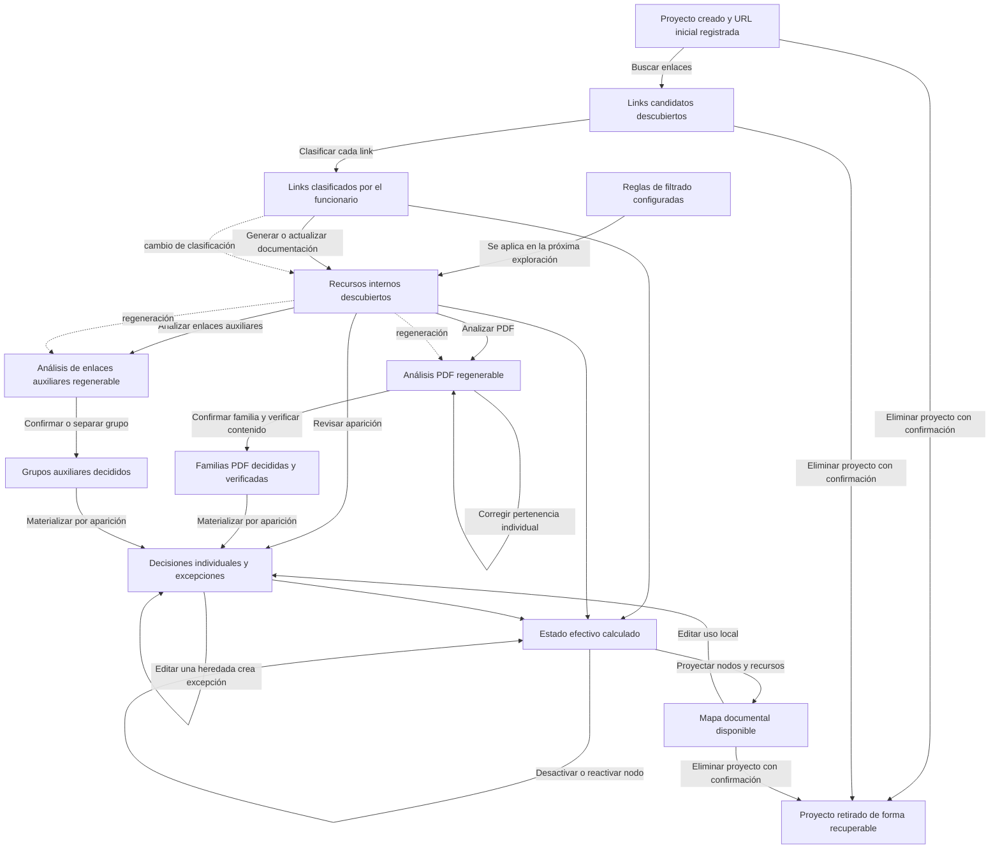

# Flujo de la aplicación

Fecha de reconstrucción: 2026-08-17.

Este documento describe el flujo real de `herramienta_modelado_tramites/`
(HMT). Se reconstruyó a partir de las llamadas entre módulos, las rutas HTTP y
las lecturas y escrituras de archivos. `tramite_graph_poc/` es un laboratorio
separado y no forma parte de este flujo operativo.

## Cómo leer el estado de HMT

HMT no implementa una máquina de estados única. `project.json.status` ofrece un
indicador grueso (`draft`, `link_review`, `reviewed` y, en la práctica,
`resource_discovery`), pero no representa por sí solo el avance completo.

El estado real de construcción se obtiene combinando:

- evidencia regenerable, como `candidate_links.json`, `node_resources.json`,
  `pdf_analysis.json` y `auxiliary_link_analysis.json`;
- decisiones humanas, como `human_review.json`, `resource_review.json`,
  `pdf_group_review.json`, `auxiliary_link_group_review.json`,
  `resource_identity_review.json` y `lifecycle_review.json`;
- vistas calculadas en memoria por `effective_project_state.py` y
  `document_map.py`.

Por eso los nodos del siguiente grafo son hitos significativos con datos
disponibles, no estados mutuamente excluyentes. Una regeneración vuelve a
producir evidencia sin borrar las decisiones humanas anteriores.

## Grafo de estados y transiciones

No existen todavía estados implementados para preguntas canónicas, grafo de
preguntas, documentación final ni estructura conversacional ejecutable.

## Tabla de estados

| Estado significativo | Qué representa | Información disponible | Archivos persistentes | Código que lee / modifica |
|---|---|---|---|---|
| Proyecto creado | Identidad, nombre y URL maestra del trámite. | Metadatos del proyecto, archivos base vacíos y trazabilidad inicial. | `project.json`, `candidate_links.json`, `human_review.json`, `resource_filter_rules.json`, `resource_review.json`, `change_log.json`. | `project_setup.py` los crea; `web_app.py` y casi todos los workflows los leen. |
| Links candidatos descubiertos | Resultados únicos extraídos del buscador oficial y sus páginas. | URL, título, categoría aparente, páginas fuente y errores parciales del recorrido. | `candidate_links.json`; `project.json.status = link_review`; evento en `change_log.json`. | `link_discovery.py` modifica; `human_review.py`, `review_links.py`, `web_app.py` y `effective_project_state.py` leen. |
| Links clasificados | Decisiones del funcionario sobre qué links participan y con qué rol. | Rol principal, roles secundarios, confianza, notas y estado de revisión. | `human_review.json`; `project.json.status` pasa entre `link_review` y `reviewed`; `change_log.json`. | `human_review.py` modifica; `node_resource_discovery.py` y `effective_project_state.py` consumen. |
| Reglas de filtrado configuradas | Política previa para retirar ruido al explorar páginas. | Reglas habilitadas por URL o texto y motivo. | `resource_filter_rules.json`. | `resource_filter_rules.py` crea, modifica y aplica; `node_resource_discovery.py` consume. |
| Recursos internos descubiertos | Inventario por cada link aceptado. | Página de origen, estado de descarga, recursos útiles y recursos descartados con regla y motivo. | `node_resources.json`; `project.json.status = resource_discovery`; `change_log.json`. | `node_resource_discovery.py` genera; análisis, revisiones y estado efectivo consumen. |
| Análisis PDF disponible | Evidencia regenerable de apariciones PDF y familias propuestas por nombre canónico. | Apariciones, familias, verificación técnica y particiones cuando existen. | `pdf_analysis.json`. | `pdf_analysis.py` genera y verifica; `resource_identity_review.py` aplica un overlay; `pdf_group_review.py` lee. |
| Familias PDF revisadas | Decisiones humanas de familia o partición. | Identidad, uso, URL canónica, nombre, notas y reconciliación con la verificación. | `pdf_group_review.json`; decisiones materializadas también en `resource_review.json`. | `pdf_group_review.py` modifica ambos; `pdf_analysis.py` reconcilia la verificación. |
| Identidad PDF corregida | Excepciones de pertenencia para una aparición PDF. | Asignación a familia, familia nueva, recurso individual o exclusión. | `resource_identity_review.json`; overlay aplicado sobre `pdf_analysis.json`; una exclusión también modifica `resource_review.json`. | `resource_identity_review.py` modifica; `pdf_analysis.py` reaplica al regenerar. |
| Análisis auxiliar disponible | Inventario regenerable de enlaces no documentales. | Apariciones, grupos por URL exacta, equivalencias normalizadas, agendas y evidencia de redirección. | `auxiliary_link_analysis.json`. | `auxiliary_link_analysis.py` genera; `auxiliary_link_group_review.py` y `web_app.py` consumen. |
| Grupos auxiliares revisados | Decisiones humanas sobre identidad y uso de grupos auxiliares. | Grupo confirmado, separado o pendiente; URL canónica, alcance, nombre y materialización. | `auxiliary_link_group_review.json`; materialización en `resource_review.json`. | `auxiliary_link_group_review.py` modifica ambos. |
| Recursos revisados individualmente | Uso efectivo de cada aparición y sus excepciones. | Contexto, enlace, descarte o revisión posterior; alcance; procedencia individual o heredada. | `resource_review.json`. | `resource_review.py`, `pdf_group_review.py` y `auxiliary_link_group_review.py` modifican; estado efectivo consume. |
| Ciclo de vida revisado | Activación o desactivación lógica de nodos sin borrar evidencia. | Estado y notas por link. | `lifecycle_review.json`; evento en `change_log.json`. | `lifecycle_review.py` modifica; `effective_project_state.py` consume. |
| Estado efectivo calculado | Unión vigente de nodos, apariciones, recursos canónicos y relaciones. | Actividad, uso, alcance derivado, huérfanos e inconsistencias de uso. | No se persiste. | `effective_project_state.py` lee cinco JSON y calcula en memoria. |
| Mapa documental disponible | Proyección navegable para auditar trámites y documentación. | Nodos terminales, recursos, cobertura inversa, consolidación y pendientes. | No se persiste; una edición desde el mapa escribe `resource_review.json`. | `document_map.py` transforma el estado efectivo; `document_map_page.py` y `web_app.py` presentan. |
| Proyecto retirado | Proyecto fuera de la lista activa, pero recuperable. | Copia completa de datos, salidas y metadatos de retiro. | `data/deleted_projects/<id>__<fecha>/deletion.json`, subcarpetas `project/` y opcionalmente `outputs/`. | `project_administration.py` mueve; aún no existe restauración desde la interfaz. |

## Tabla de transiciones

Las rutas indicadas son manejadas por `TramiteModelingHandler` en `web_app.py`.
Varias acciones también tienen equivalente CLI en `app.py`.

| Desde | Acción | Tipo | Hacia | Script principal | Funciones principales | Lee | Escribe |
|---|---|---|---|---|---|---|---|
| Sin proyecto | Crear proyecto desde formulario o `init-project` | Funcionario | Proyecto creado | `project_setup.py` | `create_project` | Parámetros del formulario/CLI | Seis JSON base, carpetas `snapshots/` y `outputs/` |
| Proyecto creado | `Buscar enlaces ahora` o `discover-links` | Funcionario dispara extracción automática | Links candidatos descubiertos | `link_discovery.py` | `discover_candidate_links`, `_discover_pages`, `fetch_page`, `extract_candidate_links`, `extract_pagination_urls` | `project.json`, HTML del buscador y paginadores | `candidate_links.json`, `project.json`, `change_log.json` |
| Links candidatos | Guardar clasificación de un link | Funcionario | Links parcial o totalmente clasificados | `human_review.py` | `save_link_decision` | `project.json`, `candidate_links.json`, `human_review.json`, `change_log.json` | `human_review.json`, `project.json`, `change_log.json` |
| Cualquier etapa previa a exploración | Activar/desactivar o agregar regla | Funcionario | Reglas configuradas | `resource_filter_rules.py` | `save_resource_filter_configuration` | `resource_filter_rules.json` | `resource_filter_rules.json` |
| Links clasificados | `Generar o actualizar documentación` | Funcionario dispara cadena automática | Recursos y análisis regenerados | `web_app.py` | `discover_node_resources` → `analyze_project_pdfs` → `analyze_auxiliary_links` | Decisiones de links, reglas, páginas aceptadas y revisiones existentes | `node_resources.json`, `pdf_analysis.json`, `auxiliary_link_analysis.json`, `project.json`, `change_log.json` |
| Links clasificados | Descubrir recursos, directamente o antes de un análisis | Automática dentro de la acción elegida | Recursos internos descubiertos | `node_resource_discovery.py` | `discover_node_resources`, `_discover_one_page`, `extract_internal_resources`, `apply_resource_filter_rules` | `project.json`, `candidate_links.json`, `human_review.json`, `resource_filter_rules.json`, páginas web | `node_resources.json`, `project.json`, `change_log.json` |
| Recursos descubiertos | Analizar PDF | Funcionario dispara análisis automático | Análisis PDF disponible | `pdf_analysis.py` | `analyze_project_pdfs`, `_pdf_candidates`, `_build_pdf_families`, `apply_pdf_membership_decisions` | `node_resources.json`, `resource_review.json`, análisis anterior y, si existe, `resource_identity_review.json` | `pdf_analysis.json`, `change_log.json` |
| Familia PDF propuesta | Confirmar familia | Funcionario; verificación posterior automática | Familia decidida y verificación en cola | `pdf_group_review.py`, `web_app.py` | `save_pdf_family_decision`, `_materialize_pdf_decision`, `mark_pdf_family_verification_queued` | `pdf_analysis.json`, `pdf_group_review.json`, `resource_review.json` | `pdf_group_review.json`, `resource_review.json`, `pdf_analysis.json`, `change_log.json` |
| Familia PDF confirmada o pendiente | Verificar contenido | Automática en segundo plano o acción manual | Familia verificada y particionada | `pdf_analysis.py` | `verify_pdf_family`, `_analyze_existing_appearance`, `_build_verification`, `_reconcile_manual_family_decision` | `pdf_analysis.json`, PDF locales o remotos, `pdf_group_review.json` | `pdf_analysis.json`, `pdf_group_review.json`, `change_log.json` |
| Partición PDF | Guardar decisión de partición | Funcionario | Partición revisada | `pdf_group_review.py` | `save_pdf_partition_decision`, `_materialize_pdf_decision` | `pdf_analysis.json`, revisiones previas | `pdf_group_review.json`, `resource_review.json`, `change_log.json` |
| Aparición PDF | Corregir identidad | Funcionario | Overlay de pertenencia aplicado | `resource_identity_review.py` | `save_resource_identity_decision`, `apply_pdf_membership_decisions` | `pdf_analysis.json`, revisión de identidad y eventualmente revisión familiar | `resource_identity_review.json`, `pdf_analysis.json`; según acción, `resource_review.json` y `change_log.json` |
| Recursos descubiertos | Analizar enlaces auxiliares | Funcionario dispara análisis automático | Análisis auxiliar disponible | `auxiliary_link_analysis.py` | `analyze_auxiliary_links`, `_build_appearances`, `_resolve_intermediate_agendas`, `_build_groups` | `node_resources.json`, `resource_review.json`, análisis anterior | `auxiliary_link_analysis.json`, `change_log.json` |
| Grupo auxiliar propuesto | Guardar decisión grupal | Funcionario | Grupo revisado y materializado | `auxiliary_link_group_review.py` | `save_auxiliary_group_decision`, `_materialize_group_decision` | Análisis auxiliar, revisiones grupales e individuales | `auxiliary_link_group_review.json`, `resource_review.json`, `change_log.json` |
| Recurso descubierto o heredado | Guardar decisión individual | Funcionario | Aparición decidida o excepción explícita | `resource_review.py` | `save_resource_decision` | `node_resources.json`, `resource_review.json`, `change_log.json` | `resource_review.json`, `change_log.json` |
| Excepción individual vigente | `Volver a heredar del grupo` | Funcionario | Aparición nuevamente heredada | `resource_group_inheritance.py` | `restore_resource_group_inheritance` | Revisión individual, análisis y revisión grupal PDF o auxiliar | `resource_review.json`, `change_log.json` |
| Decisiones persistidas | Abrir estado efectivo | Automática y de solo lectura | Estado efectivo calculado | `effective_project_state.py` | `resolve_effective_project_state` | `candidate_links.json`, `human_review.json`, `node_resources.json`, `resource_review.json`, `lifecycle_review.json` | Nada |
| Estado efectivo | Abrir mapa documental | Automática y de solo lectura | Mapa documental disponible | `document_map.py` | `build_document_map` | Estructura en memoria del estado efectivo | Nada |
| Estado efectivo | Desactivar o reactivar nodo | Funcionario | Estado efectivo recalculado | `lifecycle_review.py` | `save_node_lifecycle_status`, `node_lifecycle_impact` | Estado efectivo, `lifecycle_review.json`, `change_log.json` | `lifecycle_review.json`, `change_log.json` |
| Mapa documental | Cambiar uso de una tarjeta | Funcionario | Decisión local actualizada | `web_app.py`, `resource_review.py` | `save_resource_decision` con `scope="node_only"` | Inventario y decisión anterior | `resource_review.json`, `change_log.json` |
| Proyecto activo | Eliminar con confirmación reforzada | Funcionario | Proyecto retirado | `project_administration.py` | `delete_project_recoverably` | Carpeta completa del proyecto y salidas | Mueve datos; crea `deletion.json` |

## Regeneración y vuelta hacia atrás

`Generar o actualizar documentación` no crea una transacción única. Ejecuta
secuencialmente exploración, análisis PDF y análisis auxiliar. Si una etapa
falla, una salida anterior de la misma ejecución puede haber quedado
actualizada.

La regeneración conserva dos clases de información de manera distinta:

- las decisiones humanas permanecen en sus JSON de revisión;
- los análisis reconstruyen su evidencia y conservan identificadores de grupo
  cuando la evidencia estable coincide.

En PDF, una verificación anterior solo se reutiliza cuando no cambia el conjunto
de apariciones. El overlay de `resource_identity_review.json` se reaplica al
análisis nuevo. En enlaces auxiliares, los IDs se conservan por el valor de
evidencia; la interfaz compara las apariciones actuales con las registradas en
la decisión y pide reconfirmar si cambiaron. La función
`reapply_saved_auxiliary_group_decisions()` existe, pero no forma parte de la
ruta HTTP de regeneración actual.

## Mapa de scripts

### Interfaz y coordinación

| Script | Responsabilidad y etapa | Funciones principales | Módulos usados |
|---|---|---|---|
| `web_app.py` | Servidor HTTP local, rutas, formularios, redirecciones y coordinación de workflows. Participa en todas las etapas interactivas. | `TramiteModelingHandler.do_GET`, `do_POST` y manejadores `_save_*` | Workflows de proyecto, descubrimiento, revisión, análisis, estado efectivo y mapa; módulos `ui`. |
| `app.py` | Entrada CLI alternativa para creación, descubrimiento, revisión básica y análisis. | `main` | Workflows correspondientes y `config.py`. |
| `ui/review_links_page.py` | Genera el reporte HTML estático de links. | `save_review_links_html` | Utilidades HTML. |
| `ui/document_map_page.py` | Renderiza la proyección del mapa real. | `render_document_map_body` | Utilidades HTML; recibe datos ya calculados. |

### Lógica de negocio y transformaciones

| Script | Responsabilidad y etapa | Funciones principales | Módulos usados |
|---|---|---|---|
| `workflows/project_setup.py` | Inicializar un proyecto y sus fuentes de verdad base. | `create_project` | `config`, `json_store`, `time_utils`. |
| `workflows/link_discovery.py` | Recorrer el buscador paginado y deduplicar candidatos. | `discover_candidate_links`, `_discover_pages` | `web_reader`, `link_extractor`, `json_store`. |
| `workflows/human_review.py` | Persistir clasificación humana de links y estado de revisión. | `save_link_decision` | `config`, `json_store`, `time_utils`. |
| `workflows/resource_filter_rules.py` | Mantener y aplicar exclusiones determinísticas. | `save_resource_filter_configuration`, `apply_resource_filter_rules` | `json_store`, `config`. |
| `workflows/node_resource_discovery.py` | Explorar links aceptados y construir el inventario por página. | `discover_node_resources`, `_discover_one_page` | Extractor interno, lector web y reglas. |
| `workflows/pdf_analysis.py` | Construir familias PDF regenerables, descargar y verificar contenido bajo demanda. | `analyze_project_pdfs`, `verify_pdf_family`, `_build_pdf_families`, `_build_verification` | `pdf_analyzer`, `requests`, revisión de identidad. |
| `workflows/pdf_group_review.py` | Guardar decisiones de familia/partición y materializarlas por aparición. | `save_pdf_family_decision`, `save_pdf_partition_decision`, `_materialize_pdf_decision` | `pdf_analysis.json`, `resource_review.json`, `json_store`. |
| `workflows/resource_identity_review.py` | Aplicar correcciones humanas a la pertenencia de PDF. | `save_resource_identity_decision`, `apply_pdf_membership_decisions` | Análisis PDF, revisión familiar y revisión individual. |
| `workflows/auxiliary_link_analysis.py` | Normalizar enlaces no documentales y proponer grupos. | `analyze_auxiliary_links`, `_resolve_intermediate_agendas`, `_build_groups` | Normalizador de URL, resolvedor de redirecciones y JSON. |
| `workflows/auxiliary_link_group_review.py` | Guardar decisiones grupales auxiliares y proyectarlas a apariciones. | `save_auxiliary_group_decision`, `_materialize_group_decision`, `reapply_saved_auxiliary_group_decisions` | Análisis auxiliar y revisiones individuales. |
| `workflows/resource_review.py` | Guardar el uso y alcance de una aparición concreta. | `save_resource_decision` | Inventario de recursos, revisión y log. |
| `workflows/resource_group_inheritance.py` | Eliminar una excepción y reconstruir la decisión heredada si el grupo y su decisión siguen vigentes. | `restore_resource_group_inheritance` | Análisis y revisiones PDF/auxiliares, revisión individual y log. |
| `workflows/lifecycle_review.py` | Activar/desactivar nodos sin borrar trabajo y calcular impacto. | `save_node_lifecycle_status`, `node_lifecycle_impact` | Estado efectivo y persistencia JSON. |
| `workflows/effective_project_state.py` | Resolver en memoria el estado vigente consolidado. | `resolve_effective_project_state` | Cinco fuentes JSON; no escribe. |
| `workflows/document_map.py` | Proyectar el estado efectivo para la auditoría documental. | `build_document_map` | Estructura en memoria; no escribe. |
| `workflows/project_administration.py` | Retirar proyectos de manera recuperable. | `delete_project_recoverably` | Sistema de archivos, `project.json`. |

### Extracción, validaciones y persistencia

| Módulo | Responsabilidad |
|---|---|
| `core/json_store.py` | Lectura y escritura común de JSON. La escritura reemplaza el archivo completo; no hay transacciones ni bloqueo. |
| `core/web_reader.py` | Descarga HTML. |
| `core/link_extractor.py` | Extrae links candidatos y paginadores; valida dominio y normaliza URLs. |
| `core/internal_resource_extractor.py` | Extrae recursos del contenido principal y clasifica su tipo aparente. |
| `core/url_normalizer.py` | Analiza identidad funcional y parámetros de enlaces auxiliares. |
| `core/redirect_resolver.py` | Sigue redirecciones HTTP con límites y dominios permitidos. |
| `core/pdf_analyzer.py` | Hashes y extracción acotada de texto para comparar PDF. |
| `config.py` | Rutas, roles, límites de red y políticas técnicas. |

## Datos persistidos

Todos los JSON activos de un proyecto viven en
`herramienta_modelado_tramites/data/projects/<project_id>/`.

| Archivo | Para qué sirve | Creador / actualizador | Consumidores | Estado representado | Naturaleza |
|---|---|---|---|---|---|
| `project.json` | Identidad, URL inicial y marcador general de estado. | `project_setup.py`; luego descubrimiento y exploración. | Listado, pantallas y workflows. | Metadatos y avance grueso. | Fuente de verdad de identidad; indicador de etapa incompleto. |
| `candidate_links.json` | Evidencia de links encontrados en el buscador. | Base vacía por `project_setup.py`; reemplazado por `link_discovery.py`. | Revisión de links, descubrimiento de recursos y estado efectivo. | Universo de nodos candidatos. | Evidencia regenerable que actúa como fuente de verdad para IDs de links. |
| `human_review.json` | Clasificación humana de links. | `project_setup.py`, `human_review.py`. | Descubrimiento de recursos y estado efectivo. | Qué candidatos participan y con qué rol. | Fuente de verdad humana. |
| `resource_filter_rules.json` | Reglas de descarte previo. | `project_setup.py`, `resource_filter_rules.py`. | Descubrimiento de recursos. | Política determinística del proyecto. | Configuración mantenible. |
| `node_resources.json` | Inventario de recursos por link aceptado. | `node_resource_discovery.py`. | Revisiones, análisis y estado efectivo. | Evidencia documental descubierta. | Estado intermedio regenerable. |
| `resource_review.json` | Uso, alcance, identidad materializada y excepciones por aparición. | Revisión individual y revisiones grupales PDF/auxiliares. | Análisis, pantallas y estado efectivo. | Decisión efectiva por aparición. | Fuente de verdad operativa compuesta. Contiene decisiones humanas directas y proyecciones heredadas. |
| `pdf_analysis.json` | Apariciones, familias y verificación técnica PDF. | `pdf_analysis.py`; overlay de `resource_identity_review.py`. | Pantalla y revisión PDF. | Evidencia y propuesta de identidad PDF. | Análisis regenerable, aunque también recibe un overlay humano calculado. |
| `pdf_group_review.json` | Decisiones humanas de familias y particiones. | `pdf_group_review.py`; reconciliación de `pdf_analysis.py`. | Análisis/verificación y pantalla PDF. | Identidad y uso confirmado de PDF. | Fuente de verdad humana; incluye campos automáticos de reconciliación/materialización. |
| `resource_identity_review.json` | Correcciones individuales de pertenencia PDF. | `resource_identity_review.py`. | Regeneración de análisis PDF. | Overlay humano sobre familias propuestas. | Fuente de verdad humana. |
| `auxiliary_link_analysis.json` | Apariciones y grupos propuestos para enlaces no documentales. | `auxiliary_link_analysis.py`. | Pantalla y revisión de grupos auxiliares. | Evidencia normalizada auxiliar. | Estado intermedio regenerable. |
| `auxiliary_link_group_review.json` | Decisiones humanas de grupos auxiliares. | `auxiliary_link_group_review.py`. | Pantalla, comparación de vigencia y reaplicación manual. | Identidad y uso grupal auxiliar. | Fuente de verdad humana; contiene metadatos de materialización. |
| `lifecycle_review.json` | Activación/desactivación lógica de nodos. | `lifecycle_review.py`. | Estado efectivo. | Ciclo de vida sin eliminación. | Fuente de verdad humana opcional. |
| `change_log.json` | Eventos de creación, análisis y decisiones. | Casi todos los workflows mutables. | Auditoría; no controla el cálculo efectivo. | Historia de acciones. | Log append-only por convención, no fuente de verdad funcional. |
| `outputs/<project_id>/review_links.html` | Reporte estático de revisión de links. | `review_links.py`, `ui/review_links_page.py`. | Usuario fuera de la app dinámica. | Fotografía de candidatos y decisiones al generarse. | Salida derivada; puede quedar desactualizada. |
| `snapshots/` | Carpeta reservada. | `project_setup.py` solo crea `.gitkeep`. | Ningún flujo actual. | No representa aún un estado real. | Infraestructura no implementada. |
| `pdfs/` | PDF locales opcionales para verificar familias sin descarga. | Carga manual externa a HMT. | `pdf_analysis.py`. | Evidencia local de verificación. | Entrada auxiliar, no JSON. |
| `data/deleted_projects/.../deletion.json` | Metadatos del retiro recuperable. | `project_administration.py`. | Restauración futura, aún inexistente en UI. | Proyecto archivado. | Metadato de archivo. |

### Solapamientos relevantes

- La identidad y el uso consolidados aparecen como decisión grupal en
  `pdf_group_review.json` o `auxiliary_link_group_review.json` y como copia
  materializada por aparición en `resource_review.json`.
- `pdf_analysis.json` es análisis regenerable, pero las decisiones de
  `resource_identity_review.json` modifican su estructura persistida después de
  cada generación.
- `project.json.status`, los `review_status` de distintos JSON y la existencia
  de archivos describen dimensiones diferentes; ninguno resume por sí solo el
  estado completo.
- `change_log.json` repite valores anteriores y posteriores para auditoría, pero
  no debe usarse para reconstruir el estado vigente.

### Contrato de decisiones por aparición

Desde 2026-08-18 se verifican estas combinaciones en `resource_review.json`:

- `decision_source: individual` y `overrides_group: false`: decisión individual
  sin una decisión grupal anterior;
- `decision_source: auxiliary_group` o `pdf_group`: materialización vigente de
  una decisión grupal;
- `decision_source: individual` y `overrides_group: true`: excepción individual
  a un grupo. `overridden_group_id` identifica el grupo reemplazado y
  `source_group_id` conserva la procedencia e identidad.

Una segunda o posterior edición de la excepción conserva `overrides_group`,
`overridden_group_id`, `source_group_id` y los campos canónicos. Las
materializaciones PDF y auxiliares omiten las apariciones protegidas de esta
forma.

Desde 2026-08-19, `Volver a heredar del grupo` reemplaza la excepción por la
última decisión grupal vigente. Solo se permite si la aparición continúa en el
grupo y, para decisiones familiares o auxiliares, si el conjunto decidido
coincide con la composición actual. La operación está disponible inicialmente
en la revisión individual, afecta una sola aparición y registra el antes y el
después en `change_log.json`.

## Separación actual de responsabilidades

- **Interfaz:** `web_app.py` y `ui/`. `web_app.py` también coordina casos de uso
  y contiene bastante HTML, por lo que interfaz y orquestación están mezcladas.
- **Lógica de negocio:** `workflows/`; guarda decisiones, transforma evidencia y
  calcula proyecciones.
- **Persistencia:** archivos JSON a través de `core/json_store.py`; cada guardado
  reemplaza el documento completo.
- **Transformaciones:** extractores y analizadores en `core/`, agrupamientos en
  workflows y proyecciones de estado/mapa.
- **Validaciones:** repartidas entre formularios/rutas, workflows y extractores.
- **Generación de salidas:** reporte HTML estático en `outputs/`; las vistas de
  estado efectivo y mapa se generan en memoria para cada solicitud.

## Puntos que convendría revisar conmigo

1. **Estado global incompleto.** `config.PROJECT_STATUSES` no incluye
   `resource_discovery`, aunque `node_resource_discovery.py` lo escribe. Además,
   `project.json.status` no expresa análisis, revisión grupal, estado efectivo
   ni mapa disponible.
2. **Fuente efectiva compuesta.** `resource_review.json` mezcla decisiones
   individuales con materializaciones de grupos. La precedencia, conservación y
   restauración de herencia están verificadas, pero todo consumidor debe seguir
   interpretando correctamente `decision_source` y `source_group_id`.
3. **Análisis PDF con overlay persistido.** `pdf_analysis.json` se presenta como
   regenerable, pero su composición es modificada por decisiones de identidad.
   Conviene confirmar si se desea mantener este modelo de proyección persistida.
4. **Reaplicación auxiliar fuera del flujo principal.** Existe
   `reapply_saved_auxiliary_group_decisions()`, pero la regeneración HTTP no la
   llama. La interfaz determina vigencia comparando apariciones y exige
   reconfirmación; conviene validar que esa sea la política definitiva.
5. **Cadena no transaccional y servidor concurrente.** La regeneración puede
   dejar etapas actualizadas parcialmente y `save_json` reemplaza archivos
   completos sin bloqueo, mientras el servidor acepta solicitudes concurrentes
   y verifica PDF en segundo plano.

## Regla de mantenimiento

Actualizar este documento cuando se agregue o elimine una etapa, cambie una
transición, cambien los archivos persistentes, otro módulo pase a controlar una
etapa o se modifique de forma significativa el flujo. No requiere actualización
por refactors internos que conserven estas relaciones.
